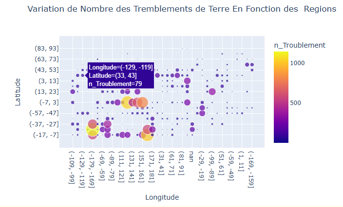

#  Dashboard Séismes

## Description
Ce projet est un dashboard interactif pour visualiser des données sur les tremblements de terre de 1965 à 2016. Il permet de suivre l'évolution des séismes en fonction de divers paramètres tels que la profondeur, la magnitude et la localisation géographique.
## Fonctionnalités
- Visualisation des tremblements de terre par région géographique
- Suivi de l'évolution des séismes par profondeur au fil du temps
- Statistiques annuelles sur la magnitude et la localisation des séismes
## Prérequis
Avant d'exécuter ce projet, assurez-vous d'avoir installé les éléments suivants :
- Python 3.x
- Bibliothèques : `pandas`, `matplotlib`, `seaborn`, `plotly`
## Installation et CONFIGURATION du projet 
Clonez le dépôt et installez les dépendances :
```bash
git clone https://github.com/salma752540/Projet-Data-VIS
cd Projet-Data-VIS
pip install -r requirements.txt
````
## Utilisation
Après avoir installé les dépendances, exécutez le projet avec la commande suivante :
```bash
python app.py
````
## Exemples d'utilisation
Voici un exemple de la visualisation des tremblements de terre par région :

## License
Ce projet est sous licence MIT. Voir le fichier [LICENSE](License) pour plus de détails.
## Contact
Si vous avez des questions, contactez-moi à [souissi.salma122000@gmail.com](souissi.salma122000@gmail.com) 


